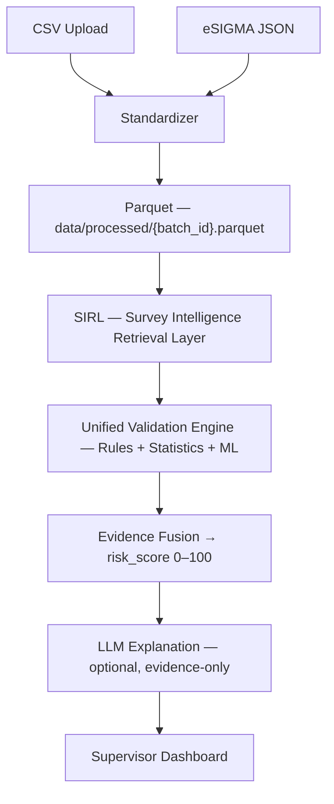

<div align="center">

# SIRL
### Survey Intelligence, Without the Guesswork.

**An explainable, evidence-fused anomaly platform for large-scale field surveys.**
**Deterministic by design. AI as a guest, never as the judge.**

[]()
[]()
[]()
[]()

*Sample extracts are synthetic/demo data, not live government survey microdata.*

</div>

---

## One more thing about AI-powered data validation.

Every "AI-powered" anomaly detector today makes the same pitch: point a
language model at your data, let it decide what looks wrong. It sounds
impressive in a demo. It's a liability in a survey with 100,000 households
and a supervisor whose job depends on the answer being defensible.

**A risk score isn't a vibe. It's a number someone has to stand behind.**

So this platform draws a hard line: rules, statistics, and machine learning
decide what's anomalous. AI is only ever allowed to *explain* — in plain
language, with stated confidence, never touching the score itself.

---

## The idea, in one sentence

> **Raw CSV/eSIGMA survey submissions become an explainable, evidence-fused, investigable anomaly dashboard — deterministic rules/statistics/ML as the source of truth, AI as an optional, privacy-conscious explanation layer.**

Built survey-agnostic. Shipped first against PLFS — India's Periodic Labour
Force Survey — because that's a real-world scale problem: thousands of
enumerators, clusters, and districts, and no way to review it all by hand.

---

## The Problem

Field surveys at scale produce data with every failure mode you can imagine:

- Impossible values — age > 100, working hours > 168/week, negative income
- Enumerator bias, or outright fabrication
- Referential breaks — records pointing to clusters, districts, or
  enumerators that don't exist
- Missing identifiers
- Statistical drift against historical survey rounds

**Manual review doesn't scale.** This platform automates the whole loop:
ingestion → profiling → multi-signal validation → risk scoring →
explainable, investigable dashboard.

---

## How It Actually Works



Nothing about that arrow from Fusion to Explanation runs backward. The score
is final before AI ever sees a summary of it.

### The architecture lock

These aren't suggestions, they're constraints baked into the build:

- CSV and eSIGMA are the *only* two inputs; both converge into one
  normalized schema.
- AI is enrichment/explanation only — **never** the source of truth.
  Scoring stays in Python. AI cannot change `risk_score`, `severity`, or
  `agreement`.
- The complete Parquet dataset is never sent to an LLM — only structured
  summaries for top-flagged records.
- AI access goes through a vendor-neutral abstraction layer, config'd via
  env vars.
- **The deterministic pipeline works end-to-end even if the AI API is
  completely unavailable.**
- No Redis, Kafka, Celery, Kubernetes, PostgreSQL, vector databases,
  LangChain, or LlamaIndex. Hackathon-scale: SQLite + Parquet, full stop.
- Live eSIGMA is only ever treated as real if `ESIGMA_BASE_URL` is
  configured *and* a probe succeeds.

---

## What "SIRL" Actually Means

**Survey Intelligence Retrieval Layer** — RAG-*inspired*, but not RAG. No
text embeddings. No vector search. No documents.

SIRL reads a completed Parquet batch and runs deterministic profiling with
Pandas/NumPy — vectorized, no external calls — to build seven structured
profile types:

```
dataset · variable · record · enumerator · cluster · district · historical
```

It can optionally enrich variable/dataset profiles with AI-generated
context — summaries only, never raw data — then persists everything to
SQLite as structured, reusable blobs.

**SIRL understands context. It does not decide anomalies, assign risk, run
ML, or generate explanations.** Those are separate, downstream phases —
because a context layer that also judges is a context layer you can't trust.

---

## The Pipeline

| Stage | What Happens |
|---|---|
| **1. Ingest → Parquet** | CSV and eSIGMA both funnel into one canonical schema — identical columns, dtypes, and missing-value policy either way. `batch_id` format: `{SURVEY}_{YYYY}_{MM}_{DD}_{NNN}`. |
| **2. SIRL Profiling** | Reads Parquet only. Vectorized groupby/transform/agg — no row-by-row loops. Historical profiles never fabricate history: no prior batch means `historical_context_available = false`, not a guess. |
| **3. Unified Validation** | Three independent channels: **Rules** (safe DSL, no `eval`/`exec`, scoped by `survey_code`), **Statistics** (z-score, IQR, PSI/KS drift, enumerator/cluster deviation), **ML** (Isolation Forest, normalized to [0,1]). |
| **4. Evidence Fusion** | Weighted combination → `risk_score` (0–100) → severity/priority tiers. |
| **5. Anomaly Classification** | A dedicated authority decides `CONFIRMED` vs. `REVIEW` vs. `NORMAL` — because a risk score alone is not a verdict. |
| **6. LLM Explanation** | Evidence JSON in, plain-language explanation out — with a deterministic fallback template if AI is down. |
| **7. Supervisor Dashboard** | KPIs, anomaly queue, record drill-down, hierarchy analytics, investigation, export. |

### Evidence Fusion weights

| Channel | Weight |
|---|---|
| Rules | 0.25 |
| Statistics | 0.25 |
| ML | 0.20 |
| Historical | 0.20 |
| AI context | 0.10 *(0 if AI unavailable — weights renormalize)* |

`risk_score = round(100 * weighted_sum)` · **HIGH** ≥ 75 · **MEDIUM** ≥ 50 ·
**LOW** ≥ 25 · else unflagged.

### The distinction that matters most: CONFIRMED vs. REVIEW

It would be easy — and wrong — to treat "statistically unusual" as
"fraudulent." This platform refuses that shortcut:

- **CONFIRMED** — only when a hard validity rule actually fired (age,
  hours, income, household, required-ID, or employment-hours bounds).
  Reference-lookup misses don't count.
- **REVIEW** — statistics and ML agree, or either alone looks unusual.
  Flagged for a human. Never called "invalid."
- **NORMAL** — nothing fired, or only a demo reference-list miss.

Language matters here as much as math: `REVIEW` records are described as
*"unusual, needs verification,"* never as errors.

---

## Sample Output, End to End

Record `M033`, batch `BATCH_2026_08_15_111911_csv_e12de2`:

```
risk_score:        98.91
severity:          CRITICAL
agreement:         strong
anomaly_status:    CONFIRMED
classification:    hard_rule_violation

Rule fired:        working_hours = 190 exceeds WORKING_HOURS_MAX (168)
Statistics:        dataset z = 4.59 · district z = 3.77 · cluster z = 3.46 · enumerator z = 2.45
ML:                Isolation Forest anomaly score 95.64 (HIGH)
AI explanation:    plain-language summary tying the rule violation, statistical
                   outlier status, and ML flag together — with a stated
                   recommended_action and explanation_confidence
```

Four independent signals, one transparent verdict, and the reasoning shown —
not asserted.

---

## The Dashboard

| Route | Purpose |
|---|---|
| `/login` | Demo auth — `FIELD_SUPERVISOR` / `SURVEY_ADMIN` |
| `/` | KPIs: processed, normal, flagged, high-risk, hierarchy summary |
| `/dashboard/ingest` | CSV upload, eSIGMA trigger, batch list |
| `/dashboard/anomalies` | Filterable, paginated anomaly queue |
| `/dashboard/records/[recordId]` | Full evidence graph: record → rules/stats/ML → fusion → classification |
| `/dashboard/analytics` | District/cluster/enumerator views (Recharts) |
| `/rules` | Enable/disable validation rules |
| `/export` | CSV / Excel — deliberately no PDF |

Investigation actions — `VERIFY`, `REQUEST_REENUMERATION`, `MARK_VALID` —
move through `OPEN → INVESTIGATING → RESOLVED`, with a full audit trail on
every status change.

---

## What Happens When AI Goes Down

This is the differentiator that actually gets tested, not just claimed:

| Stage | Behavior with AI unavailable |
|---|---|
| SIRL profiling | Full deterministic stats run normally; `ai_enriched = false` |
| Validation | Rules + stats + Isolation Forest run normally; AI channel weight → 0, others renormalize |
| Explanation | Deterministic template replaces LLM text |
| Dashboard | Shows an "AI unavailable" badge — everything else keeps working |
| Batch status | **Never** flips to a failure state purely because AI failed |

If the AI vendor has an outage, supervisors don't lose the tool. They lose a
sentence of prose, and get a template instead.

---

## Why This, and Not the Obvious Alternative

- **Multi-signal fusion, not a black box.** Rules, statistics, and ML vote
  independently — the UI shows *which sources agreed*, not just a number.
- **AI is enrichment, never the source of truth.** The deterministic
  pipeline works completely with AI switched off.
- **Privacy and cost-conscious by construction.** The full dataset never
  touches an LLM — only compact evidence summaries, for top-flagged records
  only.
- **Confirmed vs. Review, always.** Avoids the "everything unusual = fraud"
  trap that makes AI validation tools legally and ethically risky at scale.
- **Hierarchical, not just record-level.** Catches enumerator bias and
  cluster/district drift — systemic field issues, not just one bad row.
- **Survey-agnostic core.** A canonical schema plus a PLFS mapping table;
  rules scoped by `survey_code` so a second survey onboards without
  re-architecting anything.
- **Graceful degradation, everywhere.** AI down, no historical baseline,
  missing columns, unknown reference codes — every case has a tested
  fallback, not a crash.

---

## The Stack

<table>
<tr><td valign="top">

**Backend**
- FastAPI + Uvicorn
- SQLAlchemy 2 + SQLite
- Pandas / NumPy / SciPy
- scikit-learn (Isolation Forest)
- PyArrow (Parquet)
- httpx, pydantic-settings
- pytest (60+ tests)

</td><td valign="top">

**Frontend**
- Next.js (App Router) + TypeScript
- Tailwind CSS
- Recharts
- TanStack Table + Query
- lucide-react

</td><td valign="top">

**AI**
- Vendor-neutral abstraction
  (`AI_BASE_URL`, `AI_API_KEY`,
  `AI_MODEL`, `AI_TIMEOUT_SECONDS`)
- Tested with `deepseek/deepseek-v4-flash`
- Mock AI mode for deterministic testing

</td></tr>
</table>

**Explicitly excluded, on purpose:** Redis, Kafka, Celery, Kubernetes,
PostgreSQL, vector databases, LangChain, LlamaIndex, embeddings, external
profiling libraries, PDF export.

---

## The Honest Part

This is a hackathon build, frozen through Phase 11 — and that's stated up
front rather than dressed up.

**What's real and tested:** the full ingestion → SIRL → validation → fusion
→ classification → dashboard loop, 8 starter validation rules, the pipeline
orchestrator with live progress tracking, investigation workflow with audit
trail, and 60+ backend tests.

**What's explicitly out of scope for this build:** real eSIGMA production
auth/VPN integration, vector DB / document RAG, deep learning or AutoML,
streaming infrastructure, PDF reports, multi-tenant SaaS or full production
RBAC, sending full datasets to any LLM, and MLOps leaderboards.

Sample extracts are synthetic. Do not claim live eSIGMA or live AI unless
the relevant env vars are set and the health/probe checks actually succeed.

---

## Get It Running

### Environment

Copy `.env.example` to `.env` at the repo root. `.env` is gitignored —
secrets never belong in frontend code.

Required for any shared/demo host:

- `JWT_SECRET` — replace the placeholder
- `AUTH_ADMIN_PASSWORD` / `AUTH_SUPERVISOR_PASSWORD` — change the defaults
- `AUTH_COOKIE_SECURE=true` over HTTPS
- A persistent disk for `data/app.db` and `data/processed/` — an ephemeral
  filesystem loses every batch on restart

Default logins are hackathon/demo only: `admin` / `admin` (`SURVEY_ADMIN`),
`supervisor` / `supervisor` (`FIELD_SUPERVISOR`).

Leave `AI_*` and `ESIGMA_*` empty to run fully deterministic.
`ESIGMA_MOCK_MODE=true` uses the bundled fixture.

### Backend

```bash
cd backend
python3.12 -m venv .venv
source .venv/bin/activate
pip install -r requirements.txt
uvicorn app.main:app --host 127.0.0.1 --port 8000
```

Health check: `GET /api/health` → `{"status":"ok"}`

```bash
cd backend
.venv/bin/pytest -q
```

### Frontend

```bash
cd frontend
npm ci
npm run build
npm run start -- --port 3000
```

Open `http://localhost:3000`, sign in, ingest a sample CSV from
`data/samples/`, then **run validation** on the batch page — ingestion does
not auto-run the full pipeline.

---

## Hosted deployment (Vercel + FastAPI Cloud)

This repository is a monorepo. Set Vercel's **Root Directory** to
`frontend`, and FastAPI Cloud's **Application Directory** to `backend`.
The backend requires Python 3.12; its `pyproject.toml` declares
`app.main:app` as the entrypoint. Keep the repository's `data/samples/`
fixtures available for mock eSIGMA ingestion.

On the backend, configure `JWT_SECRET`, changed `AUTH_ADMIN_PASSWORD` and
`AUTH_SUPERVISOR_PASSWORD`, and `AUTH_COOKIE_SECURE=true`. Mount a persistent
writable disk and set `DATA_DIR` to its absolute path. If `DATABASE_URL` is
omitted, SQLite lives at `DATA_DIR/app.db`; if you set it explicitly, put
that file on the persistent disk too. Parquet files are stored in
`DATA_DIR/processed/`. Use one application instance with one worker: the
pipeline queue is in-process and restart recovery assumes a single owner.
A database alone does not persist Parquet; a host without persistent file
storage cannot preserve this application's data across redeploys.

On Vercel, set `BACKEND_URL` to the deployed backend's **HTTPS origin**
(e.g. `https://your-backend.example.com`, without `/api`). Set it for each
environment you deploy, including Preview. Leave `NEXT_PUBLIC_API_BASE_URL`
empty so login and all API requests use the frontend's `/api` proxy.
This keeps the HTTP-only session cookie on the frontend origin; pointing
the browser directly at a different site will conflict with the backend's
`SameSite=lax` cookie. Redeploy after changing frontend environment variables:
Next.js resolves rewrites and public variables at build time. A Vercel build
now fails clearly if the backend origin is missing, local, or malformed.

For local frontend overrides, use `frontend/.env.local`; Next.js does not
load the repository-root `.env`. The backend loads root `.env` and then
`backend/.env`, with process environment variables taking precedence.

Verify deployment by checking `/api/health` on both the backend and frontend,
then sign in and check `/api/auth/me`, upload a sample, and run validation.
Restart the backend and confirm the batch and its Parquet file remain.
If Vercel reports a blocked deployment, inspect its dashboard reason; the
lockfile must stay on a patched Next.js release, but account or deployment
protection restrictions need to be resolved in the hosting dashboard.
FastAPI Cloud startup/build errors are in the deployment's dashboard logs.

---

## Security Notes

- Secrets live in environment variables — never in the Next.js bundle.
- Session cookie: `httpOnly`, `SameSite=lax`; set
  `AUTH_COOKIE_SECURE=true` on HTTPS.
- Placeholder JWT/demo passwords are not a production identity system.
- Core validation APIs intentionally remain unauthenticated in this build —
  login gates the UI only, by explicit hackathon-scope decision.
- Do not claim live eSIGMA or live AI unless those env vars are set and
  health/probe checks succeed.

<div align="center">

---

### A risk score should be a fact you can defend, not a guess with good marketing.

</div>
